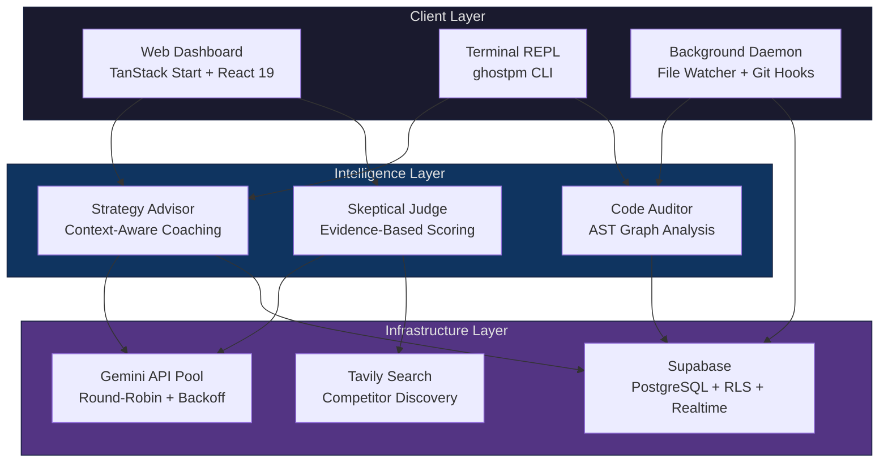
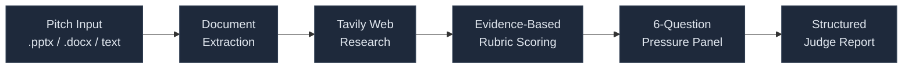
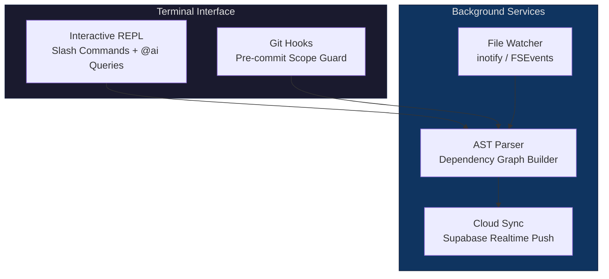
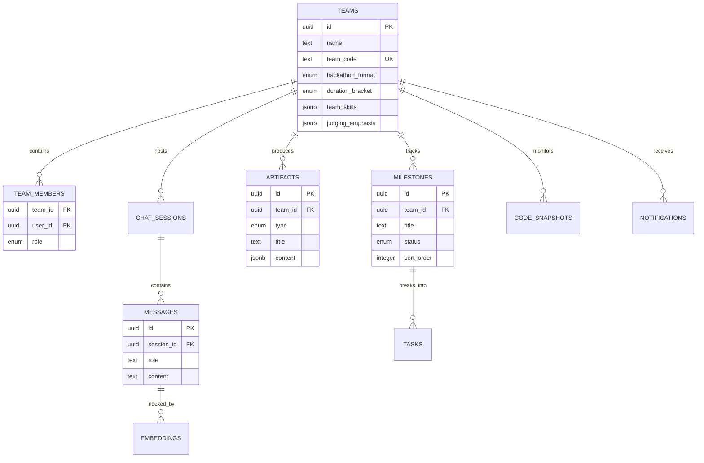
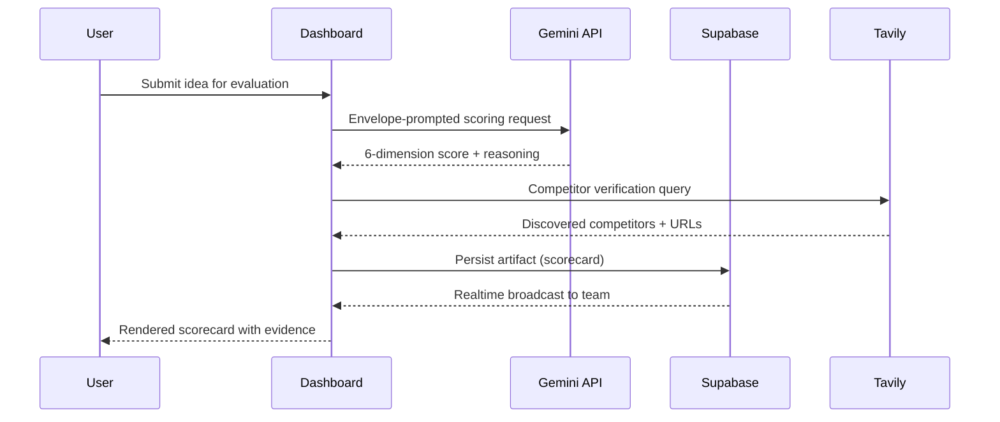

<div align="center">

```text
   ██████╗ ██╗  ██╗ ██████╗ ███████╗████████╗   ██████╗ ███╗   ███╗
  ██╔════╝ ██║  ██║██╔═══██╗██╔════╝╚══██╔══╝   ██╔══██╗████╗ ████║
  ██║  ███╗███████║██║   ██║███████╗   ██║█████╗ ██████╔╝██╔████╔██║
  ██║   ██║██╔══██║██║   ██║╚════██║   ██║╚════╝ ██╔═══╝ ██║╚██╔╝██║
  ╚██████╔╝██║  ██║╚██████╔╝███████║   ██║       ██║     ██║ ╚═╝ ██║
   ╚═════╝ ╚═╝  ╚═╝ ╚═════╝ ╚══════╝   ╚═╝       ╚═╝     ╚═╝     ╚═╝
```

# Ghost-PM

**Autonomous Hackathon Intelligence System**

[**🚀 Live Deployment (Vercel)**](https://team-catalyst-crew-avani.vercel.app/)

A multi-surface platform that coaches teams from ideation through pitch defense — combining real-time AI advisory, evidence-based judging, codebase auditing, and live collaboration into a single orchestrated system.

[](https://ai.google.dev)
[](https://supabase.com)
[](https://tanstack.com/start)
[](https://python.org)
[](LICENSE)

---

**Team Catalyst Crew** | Summer of Code Foundation 2026

</div>

---

## The Problem

Hackathon teams operate under extreme time pressure with no structured feedback loop. Ideas go unvalidated, codebases drift from scope, and pitch defenses are practiced zero times before the stage. Most teams build the wrong thing, discover competitors too late, or collapse under judge scrutiny they never rehearsed for.

## The Solution

Ghost-PM is an always-on technical co-founder that spans three interfaces — web dashboard, terminal CLI, and automated background daemon — to provide continuous, evidence-backed guidance across every phase of a hackathon.

---

## System Architecture



---

## Core Modules

### 1. Web Dashboard

Full-featured collaborative workspace built on TanStack Start with server-side rendering, Supabase Realtime synchronization, and Gemini-powered AI advisory.

| Capability | Implementation |
|---|---|
| AI Strategy Chat | Envelope-prompted Gemini sessions with hackathon context injection |
| Idea Evaluation | 6-dimension scoring matrix with weighted profiles per hackathon format |
| Artifact Generation | Scorecards, roadmaps, flowcharts, comparison tables, technical briefs |
| Judge Simulation | Full pressure-panel defense with progressive difficulty scaling |
| Code Visualization | 3D dependency graph rendering with React Three Fiber |
| Interactive Roadmap | Milestone tracking with drag-and-drop reordering and status management |
| Team Collaboration | Real-time message sync, team creation via invite codes, role management |

### 2. Skeptical AI Judge Engine

Standalone judging service that ingests pitch decks and executes adversarial evaluation with mandatory evidence citation.



**Scoring Dimensions**

| Dimension | Weight | What It Measures |
|---|---|---|
| Uniqueness | Variable | Differentiation from discovered competitors |
| Innovation | Variable | Novel technical or conceptual approach |
| Scalability | Variable | Architecture readiness for 10x-100x growth |
| Feasibility | Variable | Buildability within hackathon time constraints |
| Competition | Variable | Market positioning against existing solutions |
| Judging Fit | Variable | Alignment with specific hackathon evaluation criteria |

**Pressure Panel Progression**

```
Level 1  Easy          Problem framing and core identification
Level 2  Easy-Medium   Step-by-step technical mechanics
Level 3  Medium        Deep-dive on weakest technical claim
Level 4  Medium-Hard   Differentiation against named competitors
Level 5  Hard          Edge cases and scalability under load
Level 6  Hardest       Business viability and ethical considerations
```

### 3. Headless CLI and Background Daemon

Terminal-native interface for teams that live in the editor. Includes an interactive REPL, git hook integration, and a file-watching daemon that continuously syncs codebase health to the cloud.



---

## Data Model



All tables enforce Row Level Security. Team data is fully isolated — members can only access resources belonging to their own team.

---

## Request Flow



---

## Repository Structure

```
ghost-pm/
    app.py                        Flask server for Judge Agent
    judge_agent.py                Core skeptical judge logic
    extractors.py                 PPTX/DOCX extraction + Tavily wrapper
    test_judge_agent.py           Judge Agent test suite
    requirements.txt              Python dependencies

    cli/
        ghost_pm/
            cli.py                Command-line entry points
            repl.py               Interactive REPL + slash commands
            auditor.py            Codebase quality auditor
            daemon.py             File watcher + background sync
            graph_parser.py       AST dependency graph builder
            ai_advisor.py         Gemini client pool manager
            auth.py               Supabase auth interface
            config.py             Configuration management
            state.py              Session state handler
            hooks/                Git pre-commit + post-commit hooks
            sync/                 Cloud synchronization modules

    frontend/
        src/
            routes/               TanStack file-based routing
            components/
                Graph3D.tsx       3D dependency visualization
                InteractiveRoadmap.tsx  Milestone management
                artifact-viewer.tsx     Artifact rendering engine
                judge-panel.tsx         Judge simulation UI
                code-graph.tsx          Code analysis dashboard
                roadmap-panel.tsx       Roadmap visualization
                auth-gate.tsx           Authentication modal
                team-modals.tsx         Team create/join flows
            lib/
                auth.ts           Authentication utilities
                gemini.ts         Gemini API client
                supabase.ts       Supabase client
                memory.ts         Chat session persistence
                realtime.ts       Realtime subscription hooks
                artifacts.ts      Artifact CRUD operations

    src/                          Next.js API layer
        app/
            api/
                ai/brainstorm/    AI brainstorm endpoint
                ai/rate/          Idea rating endpoint
                ai/embed/         Embedding generation
                ai/search/        Tavily search proxy
                teams/            Team management API
        lib/
            ai/                   Gemini client configuration
            supabase/             Supabase server client

    supabase/
        schema.sql                PostgreSQL schema + RLS policies
```

---

## Installation

### Prerequisites

| Dependency | Version | Purpose |
|---|---|---|
| Node.js | 18+ | Web dashboard runtime |
| Bun | 1.0+ | Frontend package manager |
| Python | 3.10+ | Judge engine and CLI |
| Supabase Project | -- | Database, auth, and realtime |
| Gemini API Key | -- | AI model access |
| Tavily API Key | -- | Web research for competitor analysis |

### Environment Configuration

Create `.env` at the project root:

```env
# Google Gemini
GEMINI_API_KEY=

# Tavily Web Search
TAVILY_API_KEY=

# Supabase
NEXT_PUBLIC_SUPABASE_URL=
NEXT_PUBLIC_SUPABASE_ANON_KEY=
SUPABASE_SERVICE_ROLE_KEY=
```

For the frontend, create `frontend/.env.local`:

```env
VITE_SUPABASE_URL=
VITE_SUPABASE_ANON_KEY=
VITE_GEMINI_API_KEY=
```

### Database Setup

Execute `supabase/schema.sql` in the Supabase SQL Editor. This creates all tables, enums, RLS policies, and required indexes.

---

### Web Dashboard

```bash
cd frontend
bun install
bun run dev
```

Access at `http://localhost:5173`

### Judge Agent Server

```bash
pip install -r requirements.txt
python app.py
```

Access at `http://localhost:5000`

### Judge Agent CLI

```bash
# Evaluate a text idea
python judge_agent.py --idea "Your hackathon idea" --research --pretty

# Evaluate a pitch deck
python judge_agent.py --ppt pitch_deck.pptx --research --pretty
```

### Ghost-PM Terminal

```bash
cd cli
pip install -e .

ghostpm login
ghostpm join <TEAM_CODE>
ghostpm                    # Launch interactive REPL
ghostpm daemon start       # Start background watcher
```

---

## CLI Command Reference

| Command | Description |
|---|---|
| `/help` | Display available commands |
| `/status` | Team status, milestone progress, duration timer |
| `/team` | Active members and task assignments |
| `/discuss <msg>` | Broadcast to team realtime chat |
| `/advice` | Request strategic advice from Gemini advisor |
| `/graph` | Render dependency graph and codebase metrics |
| `/commit -m "msg"` | Scope-checked git commit against active milestones |
| `/milestone` | View, add, or complete project milestones |
| `/audit` | Trigger manual codebase quality scan |
| `/panic` | Activate deadline mode with forced scope reduction |
| `@ai <question>` | Direct query to AI co-founder |

---

## Testing

```bash
# Judge Agent unit tests
python -m unittest test_judge_agent -v
```

---

## Technology

| Layer | Stack |
|---|---|
| Frontend | TanStack Start, React 19, TypeScript, Tailwind CSS 4, Radix UI, React Three Fiber |
| API | Next.js 15 App Router, Serverless Functions |
| AI | Gemini 2.5 Flash, Gemini Embedding 001, Tavily Search API |
| Backend | Supabase PostgreSQL, Row Level Security, Realtime WebSockets, pgvector |
| CLI | Python 3.10+, Click, Rich, Watchdog |
| Judge Engine | Python, Flask, python-pptx, python-docx, google-genai |

---

<div align="center">

Built by **Team Catalyst Crew** for the Summer of Code Foundation 2026

</div>
