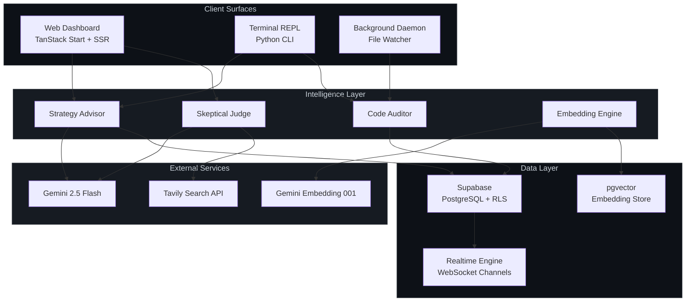
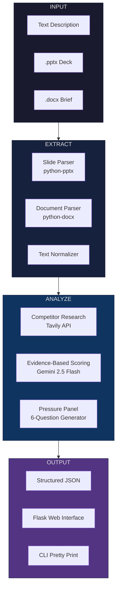
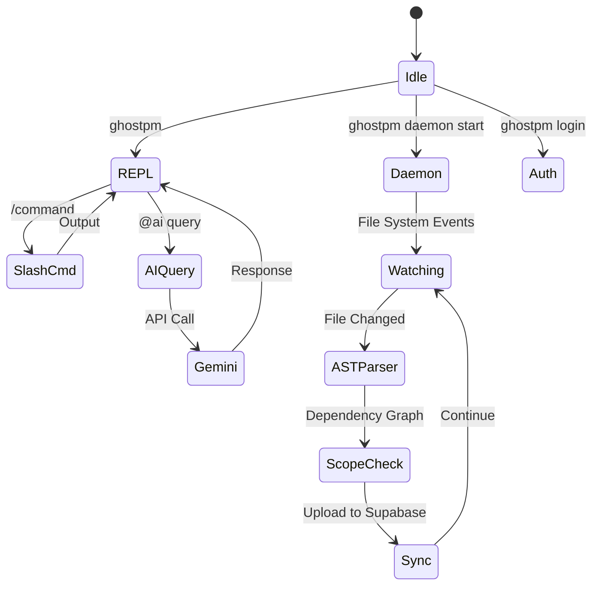
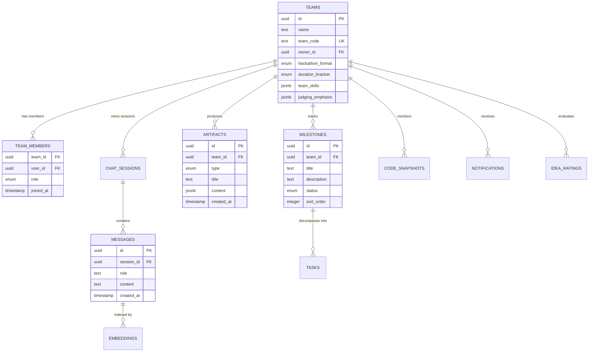
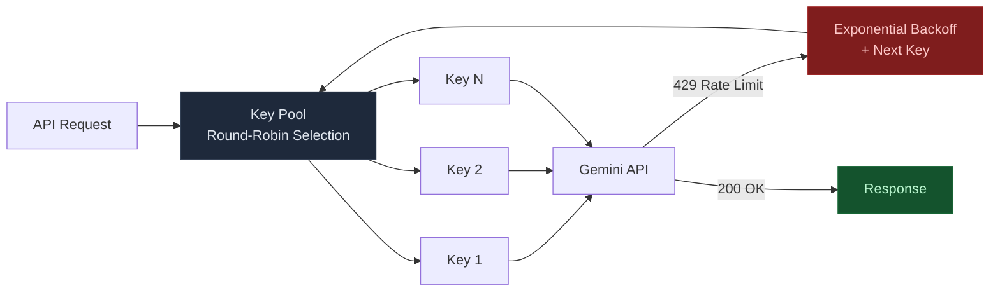

# Architecture

This document describes the technical architecture of Ghost-PM, covering system design, data flow, security model, and deployment topology.

## System Overview

Ghost-PM is a multi-surface platform with three client interfaces (web dashboard, terminal CLI, background daemon) connected through a shared intelligence layer and unified data store.



## Module Architecture

### Web Dashboard

The frontend is built with TanStack Start (React 19 + Vite + Nitro SSR). File-based routing maps URL paths to route components.

```
frontend/src/
    routes/
        __root.tsx          Root layout with providers
        index.tsx           Main dashboard view
    components/
        auth-gate.tsx       Authentication modal
        artifact-viewer.tsx Artifact rendering engine
        judge-panel.tsx     Judge simulation UI
        code-graph.tsx      Code analysis + 3D graph
        roadmap-panel.tsx   Milestone management
        team-modals.tsx     Team create/join flows
    lib/
        auth.ts             Supabase Auth wrapper
        gemini.ts           Gemini API client
        supabase.ts         Supabase client singleton
        memory.ts           Chat session persistence
        realtime.ts         Realtime subscription hooks
        artifacts.ts        Artifact CRUD operations
```

**Key Design Decisions:**

- **SSR with Nitro**: Server-side rendering for initial page load performance and SEO. Nitro handles the server runtime, enabling deployment to Vercel, Cloudflare, or Node.js.
- **Envelope Prompting**: All Gemini calls inject hackathon-specific context (format, duration, skills, judging criteria) as system instructions. This constrains AI output to remain contextually relevant.
- **Dual Persistence**: Chat history and artifacts are persisted to both Supabase (for team sync) and localStorage (for offline resilience).

### Skeptical Judge Engine



**Key Design Decisions:**

- **Mandatory Evidence Citation**: Every numerical score in the rubric must reference specific text from the submission or discovered competitors. This prevents hallucinated praise.
- **Progressive Difficulty**: The 6-question panel escalates methodically from easy framing questions to adversarial business viability challenges, simulating a real judge panel.
- **Web Research Integration**: Tavily queries run before scoring to populate the competitor landscape. Scores for Uniqueness and Competition are calibrated against real-world findings.

### CLI and Daemon



**Key Design Decisions:**

- **Non-blocking Daemon**: The file watcher runs in a separate thread to avoid blocking the REPL. Events are debounced to prevent redundant analysis on rapid file saves.
- **AST-based Auditing**: Rather than simple file diffing, the auditor parses actual code structure (imports, exports, function signatures) to measure development velocity against milestones.
- **Git Hook Integration**: Pre-commit hooks validate that changed files align with active milestone scope, preventing accidental scope drift.

## Data Architecture

### Entity Relationship Model



### Security Model

All database access is governed by Row Level Security (RLS). Policies enforce:

| Operation | Rule |
|---|---|
| `SELECT` | User must be a member of the team that owns the resource. |
| `INSERT` | User must be authenticated. Team ownership is validated. |
| `UPDATE` | User must be a member of the owning team. |
| `DELETE` | User must be the team owner. |

Team isolation is enforced at the database level. Even with a valid authentication token, users cannot access resources belonging to other teams.

### API Key Management

Gemini API calls use a **round-robin key pool** with exponential backoff:



## Deployment

### Production (Vercel)

The frontend deploys to Vercel using Nitro's Build Output API:

1. Vercel detects a push to `main`.
2. `bun install` installs dependencies in the `frontend/` root directory.
3. `vite build` compiles the application. Nitro generates `.vercel/output/` with serverless functions and static assets.
4. Vercel auto-detects the Build Output API directory and deploys.

### Local Development

```bash
# Terminal 1: Frontend
cd frontend && bun run dev

# Terminal 2: Judge Server
python app.py

# Terminal 3: CLI
ghostpm
```

All services connect to the same Supabase project, enabling cross-surface real-time synchronization during development.
